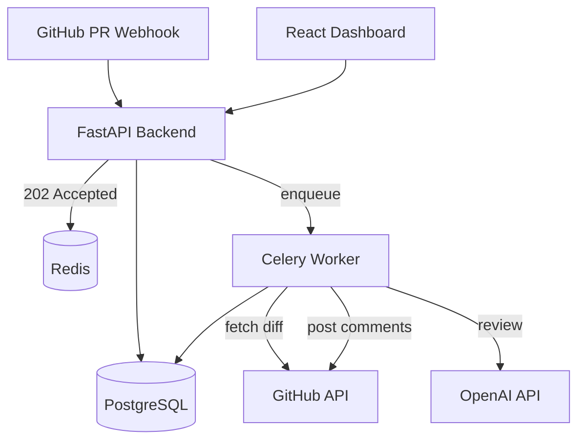

# Synapse

**Synapse** is a production-ready AI code review platform. It ingests GitHub pull request webhooks, reviews diffs with an LLM in the background, posts inline comments on GitHub, and provides an engineering manager dashboard to monitor reviews and tune focus areas.

## Features

- **GitHub App integration** — Webhook ingestion with HMAC SHA-256 signature verification
- **Async review pipeline** — Celery workers fetch diffs, filter noise, run LLM review, and post results without blocking webhooks
- **Structured AI output** — Pydantic-enforced JSON with severity, issue type, file path, line number, and suggested fixes
- **Idempotent processing** — Redis locks prevent duplicate reviews for the same commit SHA
- **Manager dashboard** — Pull request table, rule configuration, and analytics (Recharts)
- **Production-ready ops** — Multi-stage Docker images, JSON logging, and GitHub Actions CI/CD

## Architecture



| Component | Role |
|-----------|------|
| **FastAPI** | REST API, webhooks, dashboard endpoints |
| **Celery** | Background `process_pr_review` task |
| **PostgreSQL** | PR metadata, review findings, rule config |
| **Redis** | Celery broker, idempotency locks |
| **React + Vite** | Manager dashboard (nginx in production) |

## Tech Stack

| Layer | Technologies |
|-------|----------------|
| Backend | Python 3.11+, FastAPI, Pydantic v2, SQLAlchemy, Celery, PyGithub, OpenAI SDK |
| Frontend | React 19, TypeScript, Tailwind CSS v4, Lucide Icons, Recharts, React Router |
| Infrastructure | Docker, Docker Compose, PostgreSQL 16, Redis 7, nginx |
| CI/CD | GitHub Actions, pytest, ESLint, Prettier, GHCR |

## Project Structure

```
Synapse/
├── backend/
│   ├── app/
│   │   ├── api/v1/          # Routes (health, webhooks, dashboard)
│   │   ├── core/            # Config, security, logging, idempotency
│   │   ├── models/          # ORM + Pydantic schemas
│   │   ├── services/        # GitHub, LLM reviewer, dashboard
│   │   └── tasks/           # Celery tasks
│   ├── tests/
│   ├── Dockerfile           # Multi-stage production image
│   └── pyproject.toml
├── frontend/
│   ├── src/
│   │   ├── pages/           # Pull Requests, Rules, Analytics
│   │   ├── components/
│   │   └── lib/api.ts
│   ├── Dockerfile           # nginx production image
│   └── Dockerfile.dev       # Vite dev server (local compose)
├── .github/workflows/ci.yml
├── docker-compose.yml       # Local development
├── docker-compose.prod.yml  # Production deployment
└── .env.example
```

## Prerequisites

- [Docker](https://docs.docker.com/get-docker/) & Docker Compose (recommended)
- Or locally: Python 3.11+, Node.js 22+, PostgreSQL, Redis
- A [GitHub App](https://docs.github.com/en/apps/creating-github-apps) with webhook + PR permissions
- An [OpenAI API key](https://platform.openai.com/) (default LLM provider)

## Quick Start (Docker)

1. **Clone and configure environment**

   ```bash
   git clone <your-repo-url> synapse
   cd synapse
   cp .env.example .env
   ```

   Edit `.env` with your `GITHUB_WEBHOOK_SECRET`, `GITHUB_APP_ID`, private key, and `OPENAI_API_KEY`.

2. **Start the stack**

   ```bash
   docker compose up --build
   ```

3. **Open the app**

   | Service | URL |
   |---------|-----|
   | Dashboard | http://localhost:5173 |
   | API docs | http://localhost:8000/docs |
   | Health check | http://localhost:8000/api/v1/health |

4. **Point GitHub webhooks** to:

   ```
   https://<your-public-host>/api/v1/webhooks/github
   ```

   Subscribe to **Pull request** events (`opened`, `synchronize`).

## Local Development (without Docker)

### Backend

```bash
cd backend
python -m venv .venv
source .venv/bin/activate   # Windows: .venv\Scripts\activate
pip install -e ".[dev]"

# Ensure PostgreSQL and Redis are running, then:
export $(grep -v '^#' ../.env | xargs)
uvicorn main:app --reload
```

### Celery worker

```bash
cd backend
source .venv/bin/activate
celery -A app.celery_app worker --loglevel=info -Q reviews
```

### Frontend

```bash
cd frontend
npm install
npm run dev
```

The Vite dev server proxies `/api` to `http://localhost:8000`.

## Dashboard

| Route | Description |
|-------|-------------|
| `/pull-requests` | Table of recent PRs with status (Pending / Reviewed / Failed) and AI comment counts |
| `/rules` | Toggle focus areas: Security, Performance, Strict Typing, Logic |
| `/analytics` | Bar chart of issue types detected in the last 30 days |

## API Reference

| Method | Endpoint | Description |
|--------|----------|-------------|
| `GET` | `/api/v1/health` | Liveness probe |
| `POST` | `/api/v1/webhooks/github` | GitHub webhook receiver (returns `202`) |
| `GET` | `/api/v1/dashboard/pull-requests` | List PRs for dashboard |
| `GET` | `/api/v1/dashboard/rules` | Get review focus rules |
| `PUT` | `/api/v1/dashboard/rules` | Update review focus rules |
| `GET` | `/api/v1/dashboard/analytics/issue-types?days=30` | Issue-type analytics |

Interactive docs: **http://localhost:8000/docs**

## Review Pipeline

1. GitHub delivers a signed `pull_request` webhook (`opened` or `synchronize`).
2. FastAPI verifies `X-Hub-Signature-256`, acquires a Redis idempotency lock, saves PR metadata, and enqueues `process_pr_review`.
3. The Celery worker:
   - Fetches the raw diff via PyGithub
   - Filters noise (lockfiles, SVGs, deleted lines)
   - Calls the LLM with structured JSON output
   - Filters comments by saved rule preferences
   - Posts inline review comments + a summary on GitHub
   - Persists findings and updates review status

## Environment Variables

See [`.env.example`](.env.example) for the full list. Key variables:

| Variable | Description |
|----------|-------------|
| `DATABASE_URL` | Async PostgreSQL URL (`postgresql+asyncpg://...`) |
| `REDIS_URL` | Redis URL for locks and Celery |
| `GITHUB_WEBHOOK_SECRET` | Webhook signing secret |
| `GITHUB_APP_ID` | GitHub App ID |
| `GITHUB_APP_PRIVATE_KEY` or `GITHUB_APP_PRIVATE_KEY_PATH` | App authentication |
| `OPENAI_API_KEY` | OpenAI API key |
| `LLM_DEFAULT_MODEL` | Model name (default: `gpt-4o`) |
| `LOG_FORMAT` | `json` (production) or `text` (local debugging) |

## Testing

### Backend

```bash
cd backend
pip install -e ".[dev]"
pytest tests/ -q
```

### Frontend

```bash
cd frontend
npm ci
npm run lint
npm run format:check
npm run build
```

## Production Deployment

Build and run with the production Compose file:

```bash
cp .env.example .env
# Set strong secrets and ENVIRONMENT=production

docker compose -f docker-compose.prod.yml up -d --build
```

- **Backend** — multi-stage `python:3.11-slim`, non-root user, JSON logs
- **Frontend** — Vite build served by `nginx:alpine` on port 80
- **Celery** — same backend image, worker command

If upgrading from an older database schema, reset volumes or run migrations so new columns/tables exist:

```bash
docker compose -f docker-compose.prod.yml down -v
docker compose -f docker-compose.prod.yml up -d --build
```

## CI/CD

On every push and pull request to `main`, [`.github/workflows/ci.yml`](.github/workflows/ci.yml) runs:

1. **Backend tests** — pytest with Postgres + Redis service containers
2. **Frontend lint** — ESLint, Prettier, TypeScript build
3. **Docker publish** (push to `main` only) — images pushed to GitHub Container Registry:

   - `ghcr.io/<owner>/<repo>/backend`
   - `ghcr.io/<owner>/<repo>/frontend`

Authentication uses the built-in `GITHUB_TOKEN` secret — no credentials are hardcoded in the workflow.

## Logging

In production, set `LOG_FORMAT=json` for single-line JSON logs suitable for Datadog, CloudWatch, ELK, etc.:

```json
{
  "timestamp": "2026-05-17T12:00:00.000000+00:00",
  "level": "INFO",
  "logger": "app.api.v1.webhooks",
  "message": "GitHub webhook received",
  "github_event": "pull_request"
}
```

## Documentation

For a **deep dive** into architecture, tools, challenges, and design decisions:

**[docs/DEVELOPMENT_GUIDE.md](docs/DEVELOPMENT_GUIDE.md)**

## License

Proprietary — all rights reserved unless otherwise specified by the repository owner.
